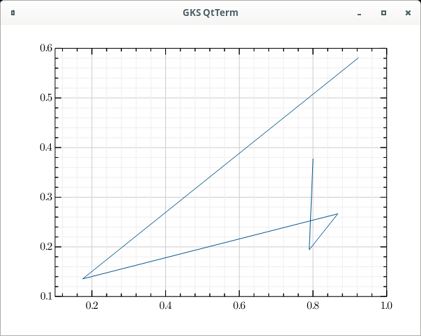

# PlotRandomValues in Julia

The code is "simple"
```
#!/usr/bin/env julia
module PlotRandomValues

using GRUtils

function julia_main()
    try
        real_main()
    catch
        Base.invokelatest(Base.display_error, Base.catch_stack())
        return 1
    end
    return 0
end

function real_main()
    println("real_main:+")
    p = plot(rand(5), rand(5))
    display(p)
    print("real_main: hit return to continue:")
    readline()
    println("real_main:-")
    return
end

if abspath(PROGRAM_FILE) == @__FILE__
    # real_main()
    real_main()
end

end # module
```
An can be run if julia is installed directly because
I added the shebang:
```
wink@3900x:~/prgs/julia/projects/PlotRandomValues (master)
$ ./src/PlotRandomValues.jl 
real_main:+
real_main: hit return to continue:
real_main:-
```

And it displays a simple graph of random lines:



You can also create a compiled version of the program using the
[PackageCompiler](https://github.com/JuliaLang/PackageCompiler.jl) in
Julia REPL from commandline **(NOTE: THIS IS SLOW)** would like to know if
it could be made faster:
```
$ time julia -e 'using PackageCompiler; create_app("PlotRandomValues", "PlotRandomValuesCompiled", force=true)'
┌ Warning: Package GR has a build script, this might indicate that it is not relocatable
└ @ PackageCompiler ~/.julia/packages/PackageCompiler/Beagl/src/PackageCompiler.jl:526
[ Info: PackageCompiler: creating base system image (incremental=false)...
[ Info: PackageCompiler: creating system image object file, this might take a while...
[ Info: PackageCompiler: creating system image object file, this might take a while...

real	4m42.616s
user	4m39.819s
sys	0m6.037s
```

And then the compiled version executed. To time these runs return was pressed twice.
First to execute then immediately a second time to stop it. This is why the
blank line before "read_main:+":
```
wink@3900x:~/prgs/julia/projects
$ time ./PlotRandomValuesCompiled/bin/PlotRandomValues

real_main:+
real_main: hit return to continue:
real_main:-

real	0m4.061s
user	0m3.755s
sys	0m0.481s
```

It should be noted because, apparently the startup is slow,
it's a little slower than the script:
```
wink@3900x:~/prgs/julia/projects
$ time ./PlotRandomValues/src/PlotRandomValues.jl

real_main:+
real_main: hit return to continue:real_main:-

real	0m3.445s
user	0m3.119s
sys	0m0.464s
```

It should also be noted that the compiled version is 261M:
```
wink@3900x:~/prgs/julia/projects
$ du -ch PlotRandomValuesCompiled/
100M	PlotRandomValuesCompiled/bin
119M	PlotRandomValuesCompiled/lib/julia
155M	PlotRandomValuesCompiled/lib
8.0K	PlotRandomValuesCompiled/artifacts/519367e9365948074c1fcc9f4365597f147a5ab7/share/licenses/MbedTLS
12K	PlotRandomValuesCompiled/artifacts/519367e9365948074c1fcc9f4365597f147a5ab7/share/licenses
16K	PlotRandomValuesCompiled/artifacts/519367e9365948074c1fcc9f4365597f147a5ab7/share
1.3M	PlotRandomValuesCompiled/artifacts/519367e9365948074c1fcc9f4365597f147a5ab7/bin
2.2M	PlotRandomValuesCompiled/artifacts/519367e9365948074c1fcc9f4365597f147a5ab7/lib
756K	PlotRandomValuesCompiled/artifacts/519367e9365948074c1fcc9f4365597f147a5ab7/logs
1.7M	PlotRandomValuesCompiled/artifacts/519367e9365948074c1fcc9f4365597f147a5ab7/include/mbedtls
1.7M	PlotRandomValuesCompiled/artifacts/519367e9365948074c1fcc9f4365597f147a5ab7/include
5.8M	PlotRandomValuesCompiled/artifacts/519367e9365948074c1fcc9f4365597f147a5ab7
5.8M	PlotRandomValuesCompiled/artifacts
261M	PlotRandomValuesCompiled/
261M	total
```
Where as src/PlotRandomValue.js is 520 bytes:
```
wink@3900x:~/prgs/julia/projects
$ ls -al PlotRandomValues/src
total 12
drwxr-xr-x 2 wink users 4096 Oct 15 14:50 .
drwxr-xr-x 5 wink users 4096 Oct 16 01:15 ..
-rwxr-xr-x 1 wink users  520 Oct 15 14:50 PlotRandomValues.jl
```

## Problem with QXcbConnectoin: XCB error:

```
wink@3900x:~/prgs/julia/projects/PlotRandomValues
$ ./src/PlotRandomValues.jl
real_main:+
real_main: hit return to continue:
qt.qpa.xcb: QXcbConnection: XCB error: 5 (BadAtom), sequence: 551, resource id: 0, major code: 20 (GetProperty), minor code: 0
real_main:-
```

Solved by exporting this QT_LOGGING_RULES:
```
$ export QT_LOGGING_RULES='*.debug=false;qt.qpa.*=false'
```
